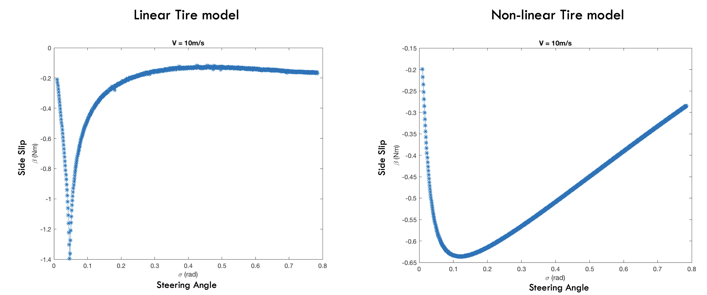
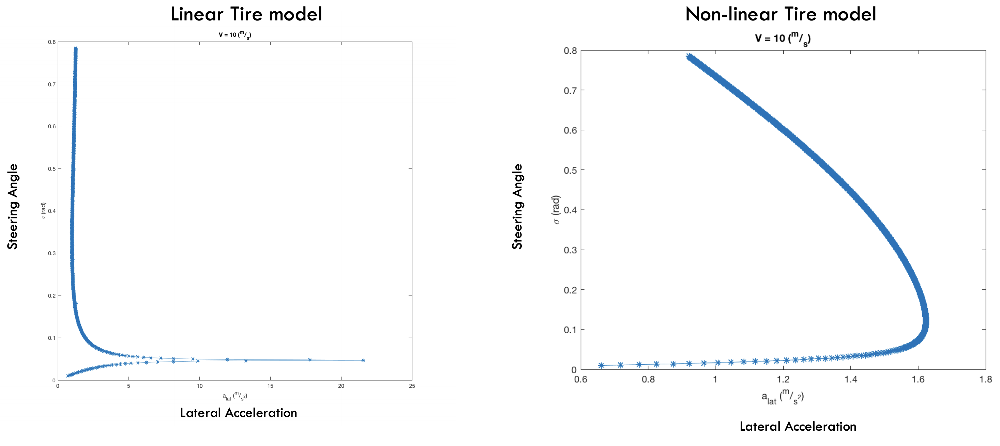
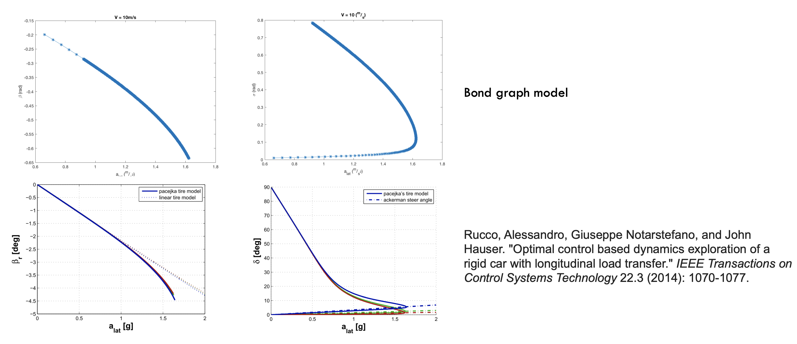

.. _car_dynamics:

Equilibrium Analysis of Vehicle Dynamics
=========================================
One question I alwasy had in mind was how do I know if my model is good enough?
the questions eventually depends on the expectations you have from the model, for example if a kinematic bicycle model is used to model a car then guarantees for the controller which uses the bicycle model are invalidated around those states when slip happens.

To verify dynamics I developped in :ref:`car_dynamics` I calculated some slices of equilibrium manifold for using linear and non-linear tire model

.. image:: ../media/slice1.png
    :width: 600
    :align: center

and eventually results were consistend with `this paper <https://arxiv.org/pdf/1112.1530.pdf>`_

Equilibrium manifol would give a lot of high level information, for example in first plot one can see that linear tire model can generate over 20 m/s^2 of latheral acceleration where as a nonliner model shows it can generate maximum of 1.6 m/s^2.

this means, as long as desired trajectories require less than 1.6 m/s^2 then using a linear tire model would be useful however more than that might result in different behaviour between physical (non-linear) and assumed model.

One should perhaps run these experiments on physical robot and compare the equilibrium manifolds of the physical system to the modeled ones to compare their performance in different areas of state space.
