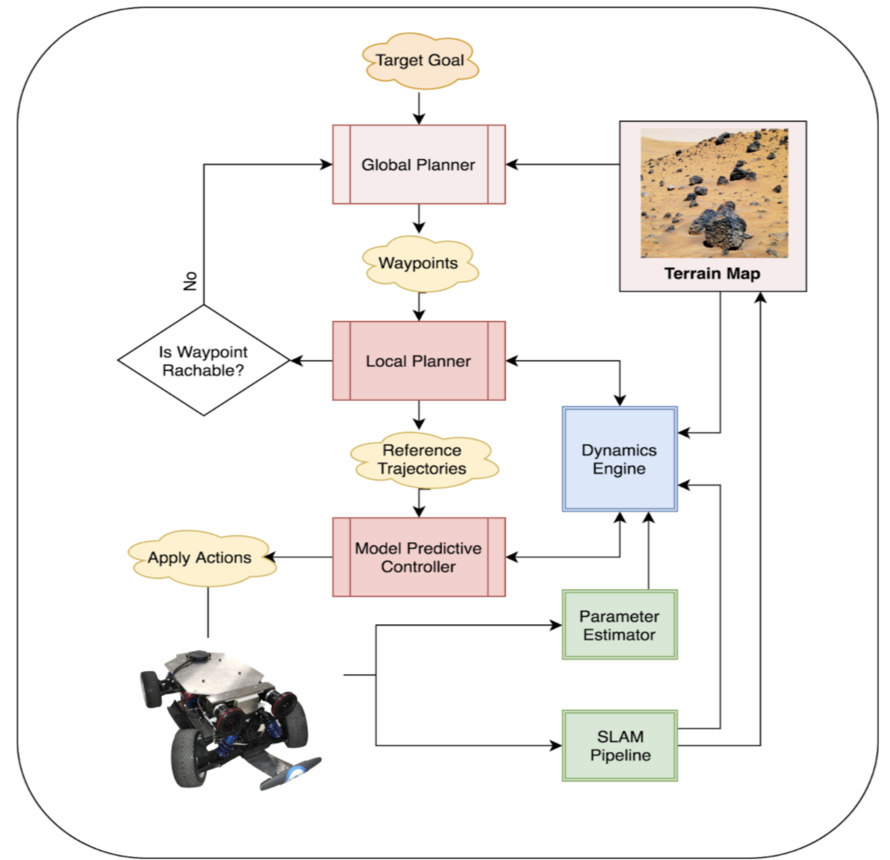
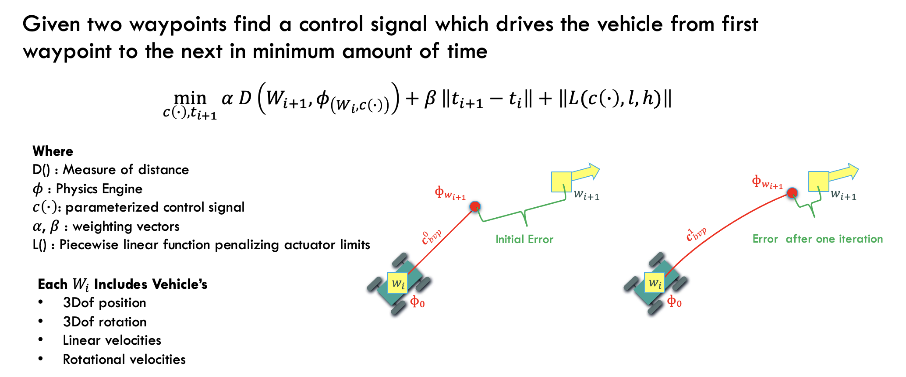
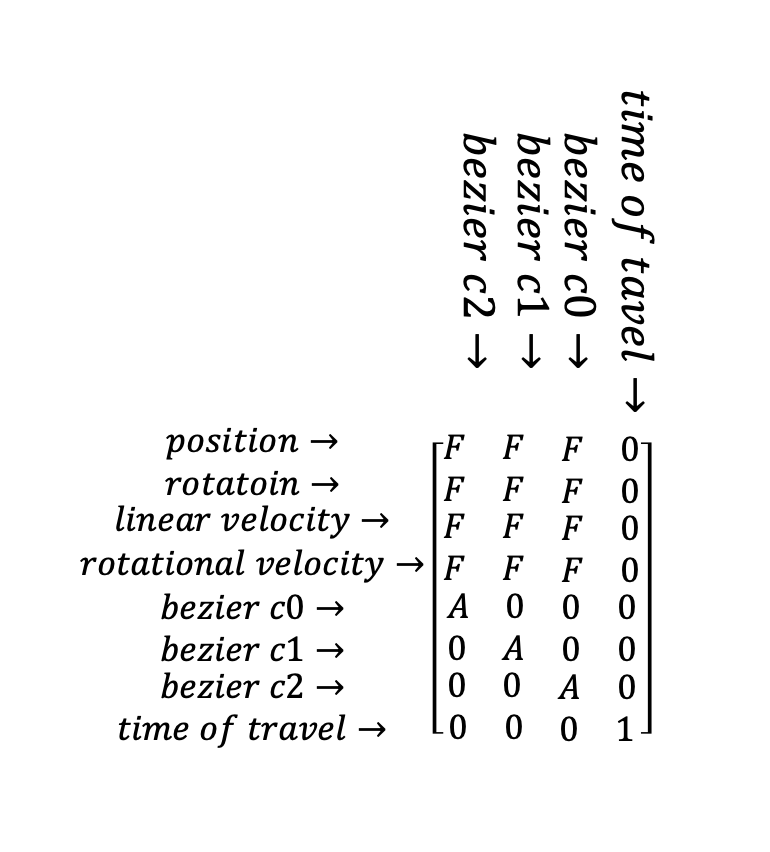
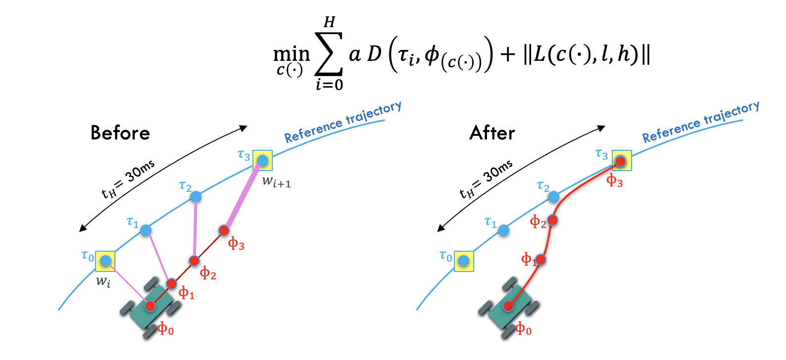
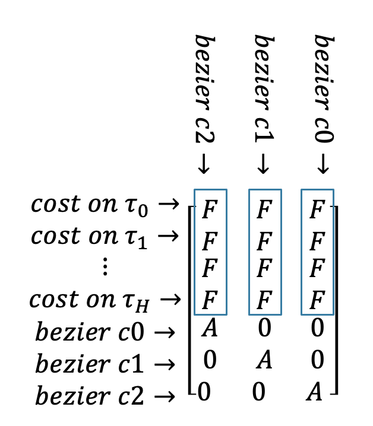

Model Predictive Control with Physics Engine in the loop
========================================================
The source code for this work can be found in `Here <https://github.com/arpg/spirit>`_

Here I have a high-level view of the method but you can find more details in my thesis.

Overall structure
------------------

Hierarchy of this motion planning alorithm is showin bellow. 
Global planner hasn't been studied in this research since there already many sampling based canditates in the field.

Local Planner
--------------

Local planner consumes waypoints from a higher level global planning algorithm and construcs an optimization based boundary value problem 
where solution to that outputs a trajectory(red line) and modified reachable waypoint(yellow square).
Output trajectory (in red) can later be used as a reference trajectory for the MPC.

The robot trajecotry in state space (positions+velocities) is parameterized with bezier curves, where some guarantees can be achieved when solving the optimization problem.

In solving the optimization problem with some numerical descent method jacobian has the following sparsity pattern.

Local Planner In Action
------------------------
Here are results of running BVP solver in three different senarios.

First when second waypoint is accessable

.. raw:: html

    <iframe width="560" height="315" src="https://www.youtube-nocookie.com/embed/hMf8_ee7F8o" title="YouTube video player" frameborder="0" allow="accelerometer; autoplay; clipboard-write; encrypted-media; gyroscope; picture-in-picture" allowfullscreen></iframe>

Second when there isn't enough ground friction so the second waypoint is not accessable

.. raw:: html

    <iframe width="560" height="315" src="https://www.youtube-nocookie.com/embed/y67EQJgVt0I" title="YouTube video player" frameborder="0" allow="accelerometer; autoplay; clipboard-write; encrypted-media; gyroscope; picture-in-picture" allowfullscreen></iframe>

Third when target velocity is to high and not reachable for the vehicle from given initial point.

.. raw:: html

    <iframe width="560" height="315" src="https://www.youtube-nocookie.com/embed/lzGz9TzNKTQ" title="YouTube video player" frameborder="0" allow="accelerometer; autoplay; clipboard-write; encrypted-media; gyroscope; picture-in-picture" allowfullscreen></iframe>

MPC
----
model predictive controller uses the reference trajectory (blue) to construct following cost function
  

the jacobian for this pattern looks like

Each column of mpc problem is independent and a physics engine simulation needs to be executed per each column. 
Because of this a multi-threaded function can simultaneously compute all columns.
This way calculation of the whole jacobian takes as long as execution of one trajectory in simulation.

Local Planner + MPC in Action
------------------------------
Here is a full simulation of running local planner followed but controling the car on desired trajectory (red) using MPC design above.

.. raw:: html

    <iframe width="560" height="315" src="https://www.youtube-nocookie.com/embed/4JPGTEltKp4" title="YouTube video player" frameborder="0" allow="accelerometer; autoplay; clipboard-write; encrypted-media; gyroscope; picture-in-picture" allowfullscreen></iframe>

